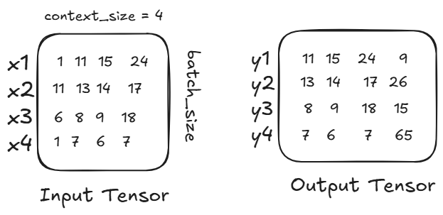
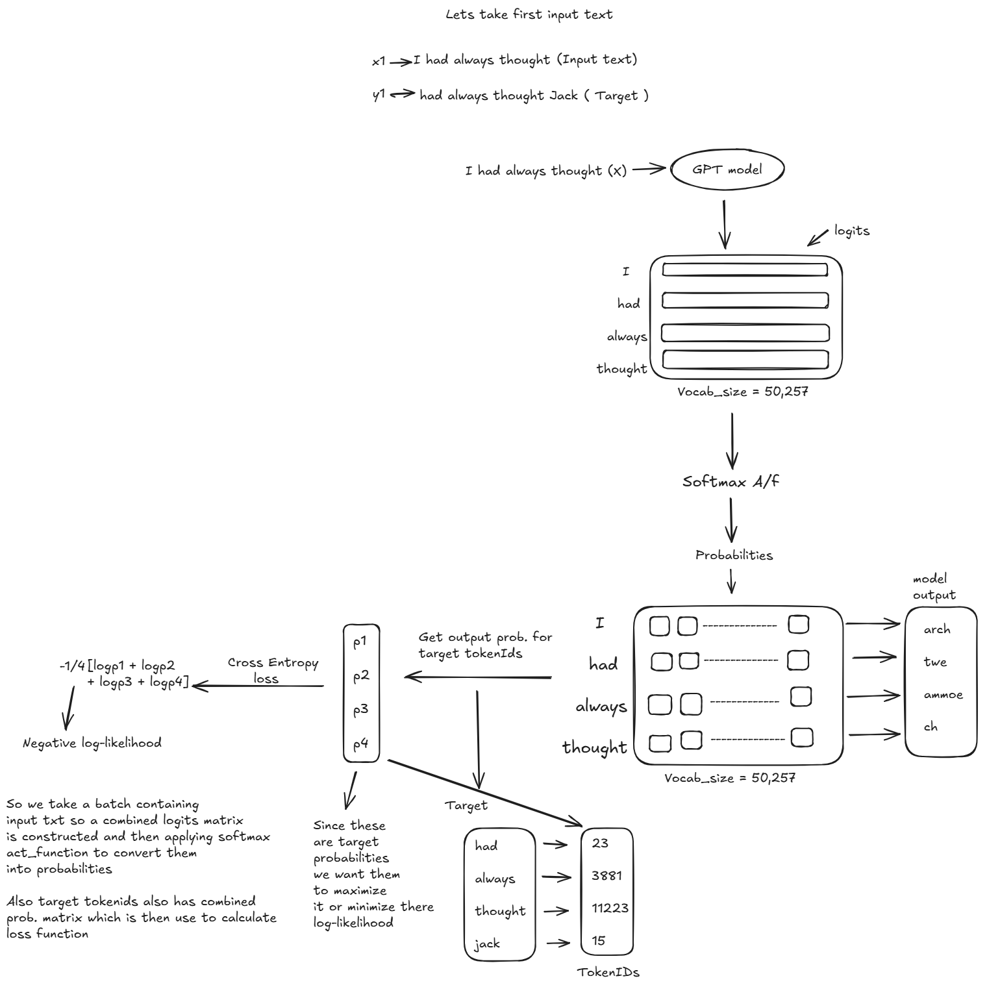

# Small Language Model (SLM) from Scratch

<div align="center">
  
</div>

## 📚 Project Overview

This project implements a Small Language Model (SLM) from scratch using PyTorch. The model is designed to generate creative and coherent stories based on the TinyStories dataset. With a parameter size of approximately 50-60 million, this SLM demonstrates how transformer-based language models can be built and trained efficiently.

### What are Small Language Models?

Small Language Models (SLMs) are compact AI systems designed to process, understand, and generate human language with significantly fewer parameters than their larger counterparts. They typically range from 500 million to 20 billion parameters, while Large Language Models (LLMs) exceed 20 billion parameters.

<div align="center">
  
</div>

## 🔑 Key Features

- **Transformer-based Architecture**: Implements a decoder-only transformer architecture similar to GPT
- **Efficient Training**: Uses techniques like gradient accumulation and mixed precision training
- **Story Generation**: Fine-tuned on the TinyStories dataset for generating simple, coherent narratives
- **Tokenization**: Utilizes GPT-2's tokenizer (Byte Pair Encoding) for efficient text representation
- **Optimized Performance**: Implements techniques to reduce memory usage and improve training speed

## 🏗️ Model Architecture

<div align="center">
  
</div>

The SLM is built on a transformer decoder architecture with the following components:

- **Token Embeddings**: Maps token IDs to vector representations
- **Positional Encodings**: Adds positional information to token embeddings
- **Multi-head Self-attention**: Allows the model to focus on different parts of the input
- **Feed-forward Networks**: Processes the attention outputs
- **Layer Normalization**: Stabilizes training
- **Dropout**: Prevents overfitting

### Model Configuration

```python
@dataclass
class GPTConfig:
    block_size: int       # Context window size
    vocab_size: int       # Size of vocabulary
    n_layer: int          # Number of transformer layers
    n_head: int           # Number of attention heads
    n_embd: int           # Embedding dimension
    dropout: float = 0.0  # Dropout probability
    bias: bool = True     # Whether to use bias in linear layers
```

## 📊 Training Process

<div align="center">
  
</div>

The training process follows these steps:

1. **Data Preparation**: Loading and tokenizing the TinyStories dataset
2. **Tokenization**: Converting text to token IDs using the GPT-2 tokenizer
3. **Batch Creation**: Creating input-output pairs for next-token prediction
4. **Model Training**: Training the model using cross-entropy loss
5. **Optimization**: Using AdamW optimizer with learning rate scheduling
6. **Evaluation**: Tracking training and validation loss

### Weight Initialization

<div align="center">
  
</div>

## 📈 Training Results

The model was trained for multiple epochs, with the loss decreasing steadily over time:

<div align="center">
  
</div>

### Loss Function Flow

<div align="center">
  
</div>

## 🚀 Inference Examples

After training, the model can generate creative stories based on a given prompt:

**Prompt**: "Once upon a time there was a pumpkin."

**Generated Text**:
```
Once upon a time there was a pumpkin. It was very special. The pumpkin wanted to paint with its family. 
So one day, a family decided to make it you all the time. They worked hard to remove something.

2 laser soldiers traveled and drove it grow into the sky. laughed like the whole."

The pumpkin stopped and smiled and felt happy for the tube. It sounded like it. Give it on big taller than it. 
They packed it and back up.

When it was done, the pumpkin had closed. It was relaxed and cozy. There were people that flying. 
Little Thursday worker Alright, the tower could during a bright, normal time. His friend said, 
"Trn into Lou, what can we do and find our flashlight?"
```

## 🛠️ Technical Implementation

The project is implemented in Python using PyTorch and includes:

- Custom implementation of the transformer architecture
- Efficient data loading and processing
- Mixed-precision training for better performance
- Gradient accumulation for effective batch size increase
- Learning rate scheduling

## 🔮 Future Directions

This project serves as a foundation for building and understanding small language models. Future extensions could include:

1. **Domain Adaptation**: Fine-tuning the model for specific domains like healthcare or automotive
2. **Model Optimization**: Implementing techniques like quantization and pruning
3. **Enhanced Generation**: Improving text coherence and quality
4. **Multilingual Support**: Extending the model to support multiple languages
5. **Evaluation Metrics**: Implementing comprehensive evaluation metrics

## 📚 References and Resources

### Papers
1. Vaswani, A., et al. (2017). [Attention Is All You Need](https://arxiv.org/abs/1706.03762)
2. Brown, T. B., et al. (2020). [Language Models are Few-Shot Learners](https://arxiv.org/abs/2005.14165)
3. Eldan, R., & Li, B. (2023). [TinyStories: How Small Can Language Models Be and Still Speak Coherent English?](https://arxiv.org/abs/2305.07759)

### Blogs and Tutorials
1. [The Illustrated Transformer](http://jalammar.github.io/illustrated-transformer/) by Jay Alammar
2. [The Annotated Transformer](http://nlp.seas.harvard.edu/2018/04/03/attention.html) by Harvard NLP
3. [Building a GPT from scratch](https://www.youtube.com/watch?v=kCc8FmEb1nY) by Andrej Karpathy

### Libraries and Tools
1. [PyTorch](https://pytorch.org/)
2. [Hugging Face Transformers](https://huggingface.co/docs/transformers/index)
3. [TikToken](https://github.com/openai/tiktoken) for tokenization

## 🙏 Acknowledgments

Special thanks to:
- The creators of the TinyStories dataset
- Andrej Karpathy for his educational resources on transformer models
- The PyTorch and Hugging Face communities

---

*This project is part of ongoing research into efficient language model implementation and training.*
